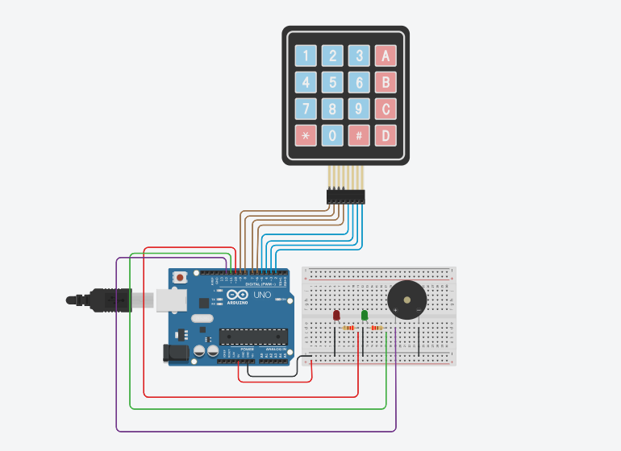
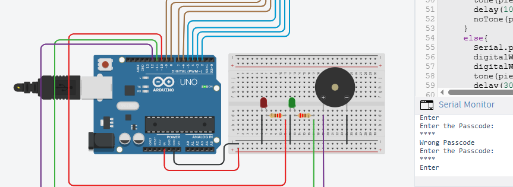
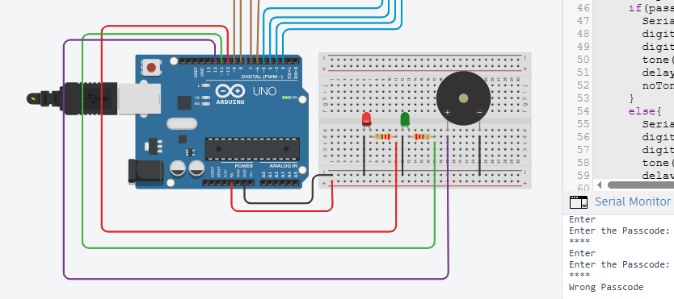

# 🔐 Arduino Password-Protected Security System
## 📖 Overview

This project is an Arduino-based password-protected security system designed to simulate an electronic door locking mechanism.

The system authenticates a user through a 4×4 keypad and grants or denies access depending on the entered password. LEDs provide visual feedback, while a piezo buzzer indicates successful or failed authentication.

The project was developed using Embedded C++ and simulated in Tinkercad.
## ✨ Features

- Password authentication
- LEDs for visual feedback 
- Audio feedback using a piezo buzzer
- Hidden password input using '*'
- Incorrect password detection
- Access granted / denied messages on the serial monitor 
- Arduino simulation using Tinkercad
## 🔧 Components Used

- Arduino Uno
- 4×4 Matrix Keypad
- Red and Green LEDs
- Piezo Buzzer
- Breadboard
- Jumper Wires
## 💻 Software

- Arduino IDE
- Embedded C++
- Tinkercad
## 📁 Repository Structure
Arduino-password_protected_security_system

├── Code
├── Images
├── Simulation
└── README.md

---

# Images

## 📷 Screenshots

### Circuit Diagram

### Access Granted

### Access Denied

---

# How it works

## ⚙️ System Workflow

1. User enters the password using the keypad.
2. Password characters are hidden on the serial monitor using '*'.
3. Arduino compares the entered password with the stored password.
4. If correct:
   - serial monitor displays "Enter"
   - green LED lights up and door opens
   - Buzzer confirms successful access
5. If incorrect:
   - Serial monitor displays "Wrong Passcode"
   - Buzzer sounds and red LED lights up
   - Door remains locked

---

# Future Improvements

## 🚀 Future Improvements

- EEPROM password storage
- Password change functionality
- RFID authentication
- Fingerprint authentication
- Bluetooth mobile control
- IoT integration
- OLED display
- ESP32 implementation

---

# Skills Demonstrated

## 🧠 Skills Demonstrated

- Embedded Systems
- Embedded C++
- Arduino Programming
- Hardware Integration
- Keypad Interfacing
- Debugging
- System Testing

---

